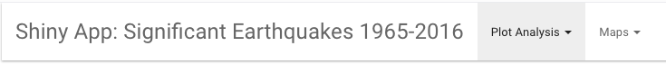

<h1 align="center">Midterm exam: create a Shiny app</h1>


## Shiny App of significant earthquakes from 1965 to 2016

This project refers to the course of *Coding for Data Science* entirely based on R programming language. 
The aim is to create a **Shiny App** that provides an interactive dashboard that allows the user to interface with plots and maps.


## About the Dataset

This is an open dataset provided by the **National Earthquake Information Center** (NEIC), a part of the Department of the Interior, U.S. Geological Survey. One purpose of NEIC is to determine the location and size of all significant earthquakes that occur worldwide. Collecting and providing data to scientists and to the public with the intention to improve the ability to locate earthquakes and to understand the earthquake mechanism.

**Content of Dataset**:
this dataset includes a record of *data*, *time*, *location*, *depth*, *magnitude*, and *source* (*Type*) of every earthquake with a reported magnitude 5.5 or greater since 1965.


## File Description

*helpers.R* : this file contains all data manipulation on the dataset.

*app.R* : this file contains the commands for building the Shiny App structure.


## The App

In the upper part of the dashboard there is the NavBar Menu where the user can select different tabs. 



**First section: Plot Analysis**

This first section provides three main plots: 

- `Number of Earthquakes since 1965` : the plot describes the number of earthquakes from 1965 to 2016. As the user can interact with the slider input he/she can notice as in the year 2011 there were 712 earthquakes, the highest value in the period considered.

- `Density function of Magnitude`: the plot is about probability density function of Magnitude, estimated on kernel density. Thanks to the checkbox the user can interact with it according the different causes of seismic waves, given by the variable Type. 

- `Density function of Depth`: the last plot of this section provides as the previous one a density function plot of Depth variable.

**Second section: Worlwide Maps**

This second section provides two maps:

- `Nuclear Explosions around the World 1965-2016`: it's shown the trend of nuclear explosion around the world. The user can interact with the slider input choosing the years of interest in order to see when there was the most intensive nuclear activity.

- `Earthquakes around the World 1965-2016` : this last map provides the trend of earthquakes around the world. Also in this case the user can interact with the slider input choosing years of interest and the range of magnitude.


## How to run the Application

I used entirely R programming language, so in order to run the application you have installed on your computer R and Rstudio. 

Then you can run the following line on your RStudio console: 

```
shiny::runGitHub ("Giuliafranchi1/earthquakes_dashboard")
```

## References

- https://www.kaggle.com/usgs/earthquake-database

- https://www.usgs.gov/natural-hazards/earthquake-hazards/national-earthquake-information-center-neic?qt-science_support_page_related_con=3#qt-science_support_page_related_con

- https://www.kaggle.com/donyoe/exploring-earthquakes/comments


